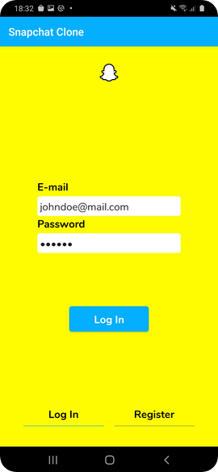
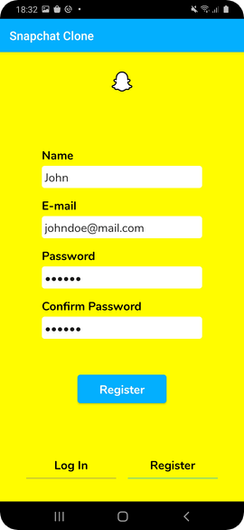
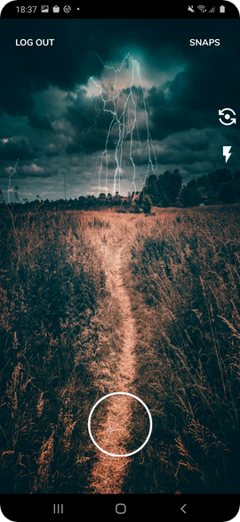
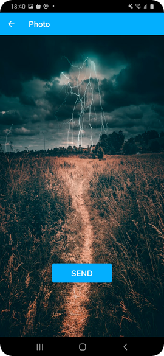
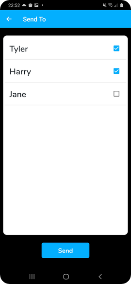
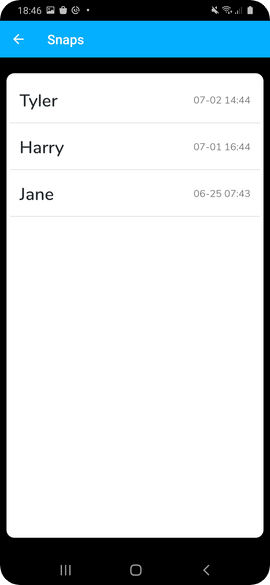
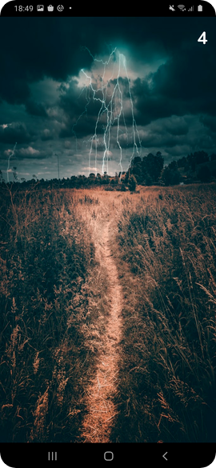
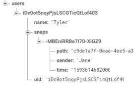

# Snapchat Clone Android
[Code Shortcut](https://github.com/dgewe/Android_Snapchat_Clone/tree/master/app/src/main/java/com/fredrikbogg/snapchatclone)

## Description
This application is a very light 'Clone' of Snapchat providing some of it's basic functionality, e.g creating a user and capturing photos to send it to other users.

The goal with the application was to learn about basic camera functionality and to create a fun and useful application.

#### Technologies
* Android Studio
* Kotlin
* Firebase
  * Authentication
  * Realtime Database
  * Storage

#### Requirements
* Android Phone with a camera (front + back)
* Basic knowledge about Android Studio and preferably Firebase

## Setup
#### Project
1. Download and open the project in Android Studio
2. Connect your phone and start the application in Android Studio

#### Firebase
  1. Create a Firebase project at https://firebase.google.com/
  2. Add a Android App in the project overview and follow the instructions

#### Firebase services
 - Setup Authentication and use the Sign-in method 'Email/Password'
 - Setup Realtime Database
 - Setup Storage

## Screenshots
<table>
<thead>
<tr>
<th align="center">Log In</th>
<th align="center">Register</th>
<th align="center">Camera</th>
<th align="center">Camera Captured</th>
</tr>
</thead>
<tbody>
<tr>
<td> </td>
<td> </td>
<td> </td>
<td> 
</tr>
</tbody>
</table>

<table>
<thead>
<tr>
<th align="center">Send To</th>
<th align="center">Snaps</th>
<th align="center">Show Snap</th>
<th align="center">Firebase Realtime Database</th>
</tr>
</thead>
<tbody>
<tr>
<td> </td>
<td> </td>
<td> </td> 
 <td> </td> 
</tr>
</tbody>
</table>

## Features

#### Activity: Main
* Log In
* Register

#### Activity: Camera
* Log out
* Go to snaps
* Camera
  * Toggle front camera
  * Toggle camera flash
  * Capture image

#### Activity: Camera Captured
* Show the captured photo
* Proceed to sending photo

#### Activity: Send To
* Select users
* Send photo

#### Activity: Snaps
* View retrieved snaps
* Select snap

#### Activity: Show Snap
* Show snap
* Countdown timer
* Remove snap
